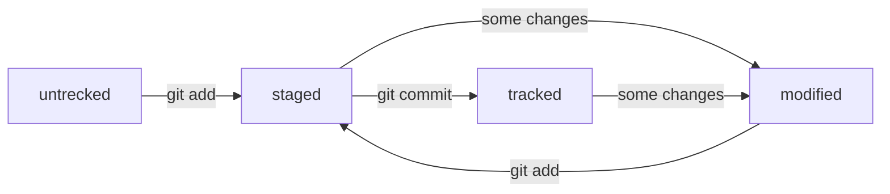

# Шпаргалка по работе с Git

## Основные команды Git

1. ```git pwd``` - выводит рабочую директорию;  
2. ```git cd путь``` - смена директории. ```..``` - переход в родительскую директорию. ```~``` - переход в домашнюю директорию;
3. ```git ls имя_директории``` - вывод файлов в текущей директории. Флаг ```-а``` выводит также скрытые файлы и директории.<br>Флаг ```-l``` выводит подробную информацию о файлах; 
4. ```git touch имя_файла.формат``` - создание файлаж
5. ```git mkdir имя_директории``` - создание директории. Флаг ```-p``` позволяет создавать структуру из вложенных директорий;
6. ```git cp парам1 парам2``` - копировать файлы. Первый параметр - копируемые файлы, второй - путь для копирования;
7. ```git mv парам1 парам2``` - переместить файлы. Работает как и копирование. Если файлы с таким именем в новой директории существуют <br>они будут удалены;
8. ```git cat имя_файла``` - вывод содержимого файла;
9. ```git rm имя_файла``` - удаление файла. ```rm -r``` - если надо удалить непустую директорию;
10. ```git rmdir имя_директ``` - удаление пустой директории;
11. ```git clip < имя_файла``` - копирование содержимого файла в буфер;
12. ```&&``` - позволяет выполнять несколько команд в одной строке

---

## Настройка Git

* ```git version``` - вывод текущей версии;
* ```git config --list``` - отображение информации папки .gitconfig. Альтернатива ```cat ~/.gitconfig```;
* ```git config --global user.name "имя"``` - задание имени пользователя;
* ```git config --global user.email "email"``` - задание почты пользователя;

---

## Создание репозитория

- ```git init``` - инициализация локального репозитория в текущей директории. Создание скрытой папки .git;
- ```rm -rf .git``` - удаление лок. репозитория. Флаг ```-r``` - recursive (рекурсия), ```-f``` - force (принудительно);
- ```git status``` - состояние репозитория, список отслеживаемых файлов, новых, измененных;
- ```git add имя_файла``` - добавление файлов для коммита. ```git add --all``` - добавление всех файлов,<br>```git add .``` - добавление папки;
- ```git commit -m "комментарий"``` - создать коммит;
- ```git log``` - выводит историю коммитов;
- ```ssh-keygen -t ed25519 -C "user_email"``` - создание ssh (secure shell ) ключей;
- ```ssh -T git@github.com``` - проверка работы ключей;
- ```git remote add origin git@github.com:Seraf741/learning_Git.git``` - добавление удаленного репозитория.<br>Имя репозитория может быть любым, в данном примере это origin.<br>```git remote -v``` - проверка связи локального и удаленного реп-риев, флаг ```-v``` - verbose (подробный);
- ```git remote rename <old> <new>``` - переименование удаленного репозитория;
- ```git branch -m <new_branch_name>``` - переименование ветки проекта;
- ```git push``` - отправка коммита в удаленный репозиторий. Для первого пуша команда будет: ```git push -u origin имя_ветки_проекта```;

---

## Хеш коммита

Хеш - набор символов всегда одной длины, задаваемой алгоритмом хеширования. Для каждого коммита создается свой уникальный хеш-идентификатор.<br>
---
Для отображения хеша всех коммитов используется команда ```git log```. Она выводит для каждого коммита его хеш, автора, дату создания, сообщение.<br>
Для вывода краткой информации о коммитах используется команда ```git log -oneline```, которая выводит сокращенную форму хеша (размер зав. от количества <br>
коммитов) и сообщение. Чтобы выйти из режима просмотра логов, надо нажать **Q**.
---
Файл **HEAD** содержит ссылку на хеш последнего коммита. Его можно использовать при указании хеша последнего коммита в консольных командах.  
---
У файлов в репозитории могут быть 4 статуса: ```untracked```, ```tracked```, ```staged```, ```modified```.  
- ```untracked``` - для всех новых файлов, к которым не была применена команда ```git add```. Они не остлеживаются VSC;  
- ```tracked``` - для всех файлов, к которым была применена команда ```git add```. Они остлеживаются VSC;
- ```staged``` - для всех файлов, к которым была применена команда ```git add```. Означает, что файл помещен в staged area, отслеживается, но еще не сохранен в коммит;
- ```modified``` - для всех файлов, которые уже отслеживаются VSC, т.е. к которым была применена команда ```git add``` и они имели статус ```staged``` (или единственный статус ```tracked```, <br>
 получаемый после коммита файлов), но которые были изменены.  
в статусе ```staged``` могут находиться как новые добавленные к отслеживаемым файлы, так и уже закоммиченные, но модифицированные. отличие будет в том, что для первых префикс в выводе ```git status```  
будет **new file**, а для старых, но измененных **modified**.
Схема цикла жизни файла в репозитории:
